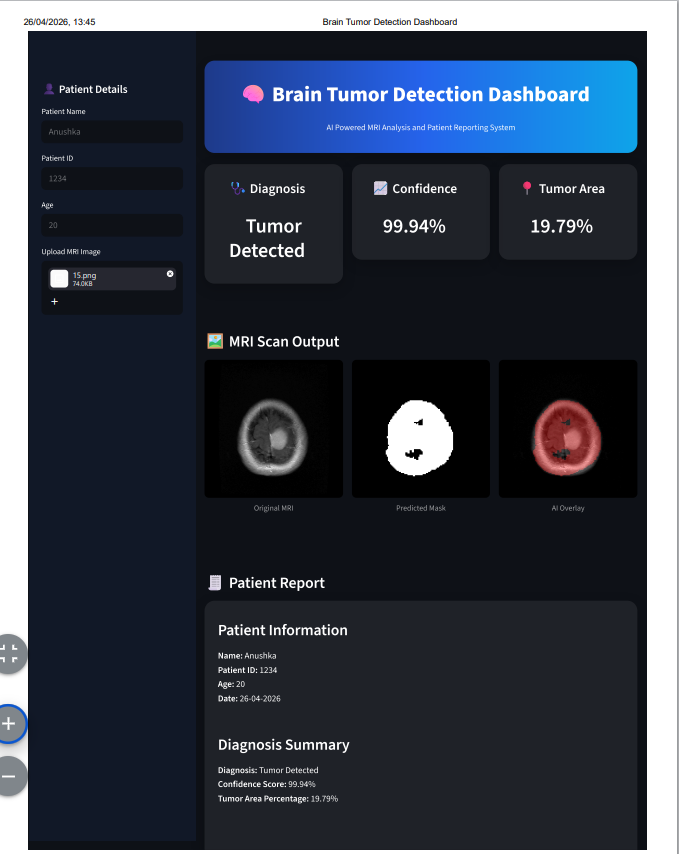

🧠 Brain Tumor Detection Dashboard

An AI-powered medical imaging dashboard for detecting brain tumors from MRI scans using a UNet deep learning model.
This project provides tumor segmentation, confidence score, tumor area percentage, AI overlay visualization, and patient report generation through an interactive Streamlit dashboard.

📌 Features

✅ Upload MRI brain scan image
✅ Detect tumor region using UNet model
✅ Generate predicted tumor mask
✅ AI overlay visualization on original MRI
✅ Dynamic confidence score
✅ Tumor area percentage calculation
✅ Professional dashboard UI
✅ Patient report generation
✅ Downloadable report

🖼️ Dashboard Preview
Original MRI Image
Predicted Mask
AI Overlay
Diagnosis Result
Confidence Score
Tumor Area Percentage
Patient Report Section

🛠️ Technologies Used
Python
Streamlit
PyTorch
OpenCV
NumPy
Pillow
UNet Architecture

📊 Model Information
This project uses a UNet segmentation model trained on MRI brain tumor datasets.
Model Output:
Binary Tumor Mask
Confidence Score
Tumor Area %
Overlay Visualization

## 🖼️ Dashboard Preview 

